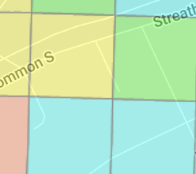

This is an update of the [old SCECO website](http://www.sceco.org.uk/) to fight new campaigns.
Note that this has no affiliation with the [Saudi Consolidated Electric Company](https://acronyms.thefreedictionary.com/SCECO).

## When is a conservation area not a conservation area again.

Planning application [23/03943/FUL][PlanningApplication2023] for Number 6 Streatham Common South will cause immense harm to our area.:

- Convert the Streatham Common South into a 24 7 industrial lorry park
- Destroy the historic builders yard.

We have until the 7th of January to get objections in.  If you can spare 2 minutes of your time you can help save the area by objecting to this development:

1. Make a comment on the planning application [23/03943/FUL][CommentPlanningApplication2023] 
1. You may have sign in or register for mylambeth
1. Select commenter type if neighbour, public or other
1. Select stance **Object**
1. Add your own comment or could use the following draft objections:

## Issues

1. The planning application is wrong and I think a tree survey is rquired.
- There is at least one tree on the site so the answer to Trees and Hedges is wrong.
- There are large trees adjacent to the site that might have to be pruned so I believe the second part is wrong
- A number of pine trees have been cut down and removed from and adjacent garden presumably in preparation for this work and this will have affected the view from Streatham Common.
1. The site does regularly flood during heavy rain.
1. The increased traffic and congestion is going to lead to loss and so change of use of adjacent Streatham Commont South.
1. The [Land registry title register](/2023-6scs/6scs/2023-08-04_summary_of_title_SGL377507_GOV.UKa.pdf) denote two owners of the land but this application only shows one owner Nw1 IOS 1 Unit Trust.

Block plan
1. Does not include existing bunds nor demolitiion of existing bunds
1. Does not include sand bagging block nor demoliton of the bagging block

## Submitted documents

- [Application form](/2023-6scs/6scs/APPLICATION_FORM_-_WITHOUT_PERSONAL_DATA-3142896.pdf) Inaccurate
- [Block Plan](/2023-6scs/6scs/BLOCK_PLAN_OF_THE_SITE-3142904.pdf)
- [Community Infrastructure Levy](/2023-6scs/6scs/COMMUNITY_INFRASTRUCTURE_LEVY_-_COMPLETED_FORM-3142899.pdf)
- [Elevations](/2023-6scs/6scs/EXISTING_AND_PROPOSED_ELEVATIONS___SECTIONS-3142900.pdf)
- [Site plan](/2023-6scs/6scs/EXISTING_SITE_PLAN-3142901.pdf)
- [Heritage Assesment](/2023-6scs/6scs/INC._HERITAGE_ASSESSMENT-3142908.pdf) Also inaccurate due to trees and bagging bund.
- [Location plan](/2023-6scs/6scs/LOCATION_PLAN-3142905.pdf)
- [Noise impact assessment](/2023-6scs/6scs/NOISE_IMPACT_ASSESSMENT-3142902.pdf)
- [Noise management plan](/2023-6scs/6scs/NOISE_MANAGEMENT_PLAN-3142903.pdf)
- [Transport statement](/2023-6scs/6scs/TRANSPORT_STATEMENT-3142906.pdf)
- [Travel Plan Statement](/2023-6scs/6scs/TRAVEL_PLAN_STATEMENT-3142907.pdf)

## Heritage assesment

- Inaccurate in that the yard has been in operation as a builders yard for over 200 years.
- Inaccurate in that there are no trees
- Streatham high road to the west is not adjacent to the site.  It is in fact next a nursing home and residential uses.
- The site covers 2,3,4 not only 4 as is claimed. 
- Claims bizarrly that change to B8 will be beneficial from chaning to B8 which was refused last time.
- Planning permission

[PlanningApplication2023]: https://planning.lambeth.gov.uk/online-applications/applicationDetails.do?keyVal=S59KBSBOH0G00&activeTab=summary
[CommentPlanningApplication2023]: https://planning.lambeth.gov.uk/online-applications/applicationDetails.do?activeTab=makeComment&keyVal=S59KBSBOH0G00